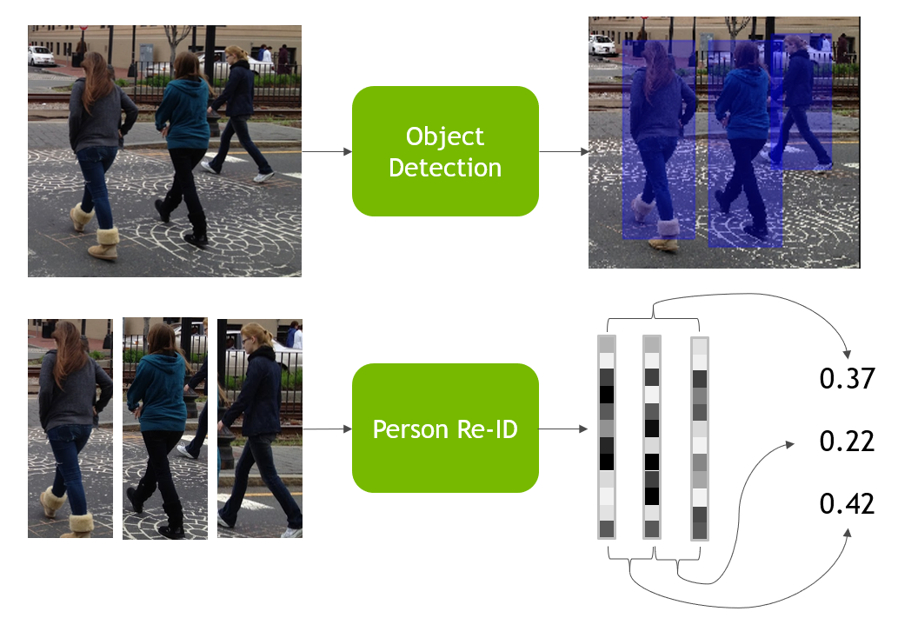
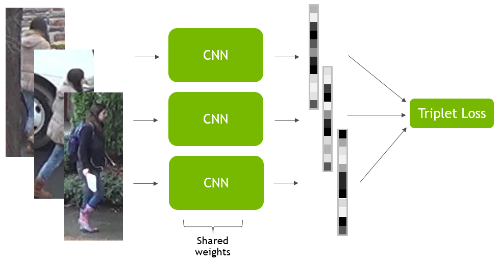

Human REID in NVIDIA Jetson 
===========

 

This repository contains scripts and documentation for the training and deployment of fast person re-identification on NVIDIA's Jetson platform.
The object detection model and corresponding scripts were taken from jetson tf-trt-models, found at (https://github.com/NVIDIA-Jetson/tf_trt_models) ,
while the backbone of the re-identification model is a Resnet-50-v1 taken from the tensorflow models repository. The code to run the camera on Jetson was taken from
(https://github.com/NVIDIA-Jetson/argus_camera). 

* [Setup](#setup)
  * [Desktop setup](#setup_desktop)
  * [Jetson setup](#setup_jetson)
* [Datasets](#datasets)
* [Quick Run](#qr)
* [Person Re-Identification Explanation](#exp)
  * [High Level Explanation](#exp_method)
  * [Triplet Loss](#exp_loss)
  * [The Approach](#exp_app)
  * [Triplet Mining](#exp_mine)
  
* [Training ID model](#id)
* [Training Re-ID model](#reid)
* [Jetson and Demo](#jad)

<a name="setup"></a>
Setup
-----
<a name="setup_desktop"></a>
Setup for Desktop
-----------------
1. Install tensorflow, numpy, and cv2.
    ```
    pip3 install numpy tensorflow cv2 pprint
    ```
2. Clone this repository.
    ```
    git clone https://github.com/NVIDIA-Jetson/reid.git
    cd reid
    ```
3. Run the installation script.
    ```
    bash setup.sh
    ```

Setup For Jetson
----------------
<a name="setup_jetson"></a>
  1. Follow the instructions at (https://github.com/NVIDIA-Jetson/tf_trt_models)
  2. Follow the instructions at (https://github.com/NVIDIA-Jetson/argus_camera)
  3. Clone this repository
      ```
      git clone https://github.com/NVIDIA-Jetson/reid.git
      ```
  4. Install OpenCv.
      ```
      pip3 install cv2
      ```
  5. For good performance, put the Jetson TX2 in MAX-N mode.
      ```
      sudo nvpmodel -m 0
      sudo ~/jetson_clocks.sh
      ```
      
<a name="datasets"></a>
Datasets
--------

Currently, the scripts expect you to download Duke MTMC Re-ID or Market 1501 and put them in a folder called data. They get the class of the person from the filename in the format that these two datasets. TODO: MAKE SCRIPTS TO DO THIS To use with a different dataset you should:
 1. Download the dataset to ./data
 2. Rename the train, test, and query folders to "bounding_box_train", "bounding_box_test", and "bounding_box_query" respectively.
 3. Override or rewrite the get_class_from_path() ImageDataset class in utils/dataset.py. This should get the id of the person from the path. e.g. if the path is /path/to/file/1425_cam1_f1223.jpg and the class is 1425, the function should get that from the path. Make sure this is correct!

<a name="qr"></a>
Quick Run
---------
For those who want to straight get to it:
   
    bash train_id.sh
    vim train_reid.sh #change id_model to the path you trained your id model to, e.g. /path/to/reid/models/m0/model.ckpt-1501
    bash train_reid.sh
    scp models/reid/path/to/model nvidia@{JETSON_IP}:/path/to/repository/ #move your model to jetson

Swap to the Jetson, and run:
    
    python3 pipeline.py
    python3 demo.py


<a name="exp"></a>
Explanation of Person Re-Identification
---------------------------------------

Person Re-Identification, person re-id, or just re-id, is the task of re-identifying a person from an image. For example, our re-id method should be able to take two pictures of people, and compare them in some way to determine if they are the same, and give a similarity score to them. The method need not have seen these particular identities before.


As you can see, we have three images: and the network assigns a PSIMSCORE level of similarity to the two images on the left (of the same perseon), but assigns a NSIMSCORE to the two on the right. One can think of the re-id task as similar to face recognition, but where the entire body is used as opposed to just the face.

<a name="exp_method"></a>
High Level Explanation
----------

The method used here uses a deep network to compute feature vectors of images, and then compares the cosine distance between the vectors to compute a similarity score. The deep network uses a ResNet 50 backbone, and takes in a cropped image of a person. Since the network takes in cropped images of one person, in practice we must use an object detector to extract bounding boxes of people from, for instance, a camera feed:


To train this network, we need a special loss function - as we don't have knowledge of what our vectors for each image should be. This loss function is known as triplet loss.

<a name="exp_loss"></a>
Triplet Loss
-----------------

Triplet loss is named such because it maps from three images to a scalar loss, instead of a more typical setup where one image and label can incur a loss. The three images are called the anchor, the positive, and the negative. The anchor is any image from the dataset, while the positive must come from the same class and the negative must come from a different class. 



The top image is the anchor, the middle is the positive (same person as the anchor), and the bottom-most is the negative.
We want the network to give a higher similarity score to the anchor-positive pair than the anchor-negative pair. However, we don't particularly want the similarity score between the anchor-positive pair to be as high as possible and the anchor-negative pair to be arbitrarily dissimilar.

With this in mind, the formula for triplet loss is: 
  
  ```
  diff = sim(a, n) - sim(a, p)
  triplet_loss = max(0, margin - diff)
  ```

Margin is a hyperparameter, often set at 0.1, while sim(x, y) is the similarity of the two vectors output by the network, and can take the form of <x, y>. 
Intuitively, this loss penalizes the network for having sim(a, p) being less than the margin greater than sim(a, n). If this condition is met, no loss is incurred.

<a name="exp_app"></a>
The Approach
-------------

The approach this project takes is roughly that of https://arxiv.org/pdf/1801.05339.pdf, but with a few modifications to speed up inference on Jetson--only ResNet-50 is used, as the larger networks take much more time to run, and we use fixed-size bounding box inputs to enable acceleration by TF-TRT. 

In summary, we use a ResNet-50 CNN pretrained on ImageNet, and we retrain it to classify the identities of people in the training set, and then use it as an initialization for the re-id task. This significantly improves performance by giving a better initialization--presumably, this makes the conv filters useful for distinguishing between people in the dataset, as opposed to the default ImageNet features. After we train on the people, we take the convolutional layers from our network, perform global maximum pooling to get a 2048x1 feature vector, apply a 2048x2048 fully connected layer, and normalize the output to get our embeddings. We use the dot product to calculate similarity.

<a name="exp_mine"></a>
Triplet Mining
--------------

Click on the proper runs -- one is training and one is validation for each model, and monitor the loss as it decreases each step. Keep track of around where the validation loss first starts flattening out. This is where you'll initialize the reid model from.

This setup is trained using Triplet Loss with batch-hard offline triplet mining implemented in python and numpy. Triplet mining refers to the process of finding the best triplets to train the network on--if you use random triplets, the network has sub-par performance and small gradients, as its very easy for the triplet loss to be zero. Online triplet mining could also be used here (and would be faster), but we found this approach sufficient. The triplet mining works as follows:
We want batch_size * k query examples. k is a hyperparemeter controlling how many batches there are before we mine again.
  
  1. Select N (a hyperparameter) images from the training set. We will only search through these for the next steps.
  2. Select batch_size * k random "queries" randomly. These will serve as our anchors.
  3. For each query, find the images in the same class which the network gives the most loss-where the similarity between the anchor and the sample is as low as possible. We calculate this with our current network!
  4. For each query, find the hardest negative images: those where the similarity between the anchor and negative is as high as possible. We also evaluate this with our current network.
  5. For each query, choose the positive-negative pair randomly from the hardest sample_num (another hyperameter) options. These query-positive-negative triplets will be trained on.

We train on these (batch_size * k) triplets, and then we run hard triplet mining again to get the next epoch.

<a name="id"></a>
Training the Classification Model
---------------------------------

To pretrain the ResNet on the dataset, run
```
bash train_id.sh
```
The default hyperparameters should be sufficient. The network will overfit on most re-id datasets due to their small size, so this should be monitored using tensorboard:
```
cd models
tensorboard --logdir=.
```

Then open a browser, and navigate to ```localhost:6006```. 

TENSORBOARD IMAGE

Click on the proper runs -- one is training and one is validation for each model, and monitor the loss as it decreases each step. Keep track of around where the validation loss first starts flattening out. This is where you'll initialize the reid model from. In this image, the best place is around step NUMBER.

When stopping and restarting training, open train_id.sh and edit such that restore=True and id to the model number from which to restore. This id refers to which folder your model is located, e.g. id=1 refers to ```models/id/m1```. To start a new training, set restore=False .

<a name="reid"></a>
Training the Re-Identification Model
------------------------------------
Click on the proper runs -- one is training and one is validation for each model, and monitor the loss as it decreases each step. Keep track of around where the validation loss first starts flattening out. This is where you'll initialize the reid model from.
To train the re-id model, set the id_model flag ```in train_reid.sh``` to point to the model which you want to initialize from. For example, if your model is in ```models/id/m1``` and you'd like to initialize from step 1501, the path would be ```models/id/m1/model.ckpt-1501```. 

Then, run
```
bash train_reid.sh
```
Training will take many hours, partly due to the time-consuming nature of hard triplet mining. After training, you can look at tensorboard graphs to determine when the model overfit. Additionally, by editing test_reid.sh to point to the correct re-id model and running it, you can check the rank-1 and rank-5 accuracy of the model. Rank-1 accuracy above 78% and rank-5 accuracy above 88% should be achieved with the default hyperparameters. 

<a name="reid_hyp"></a>
For those interested, here is the description for the hyperparameters of the re-id model:


<a name="jad"></a>
Deployment on Jetson and Demo
-----------------------------
In order to deploy and optimize the model for Jetson, one must move the .ckpt files from the desktop or server the model was trained on to the Jetson, i.e.:
```
scp models/reid/m{}/reid_model-200.ckpt* USER@JETSON_IP:/home/USER/
```
Then, we can move to jetson. To download and optimize both the object detection model, and optimize the reid model:
```
python3 pipeline.py obj PATH/TO/REID/MODEL.ckpt
```
Finally, to run the live demo:
```
python3 demo.py
```
